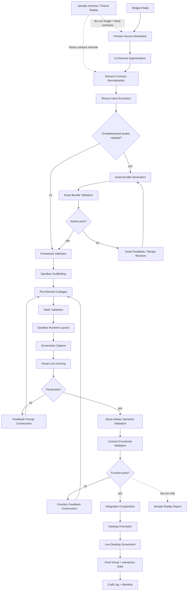

# Widget / Dashboard DAG Plan for linux-ricing

> For Hermes: Use subagent-driven-development skill to implement this plan task-by-task after user review.

Goal: Replace the current monolithic Step 6 craft path for custom dashboard/widgets with a detailed directed acyclic graph that can segment UI elements from the approved preview, build each widget in isolation, validate visual and functional quality, then safely integrate it onto the live desktop.

Architecture: Keep the existing LangGraph 8-step workflow, but split the Step 6 `craft_node` path into a nested widget pipeline for `widgets:*` elements. The outer workflow still owns user gates, rollback manifests, session state, and final cleanup. The nested pipeline owns widget decomposition, framework selection, sandbox generation, screenshot capture, visual loss scoring, interactive/function tests, and desktop promotion.

Tech stack: Python pipeline modules inside `workflow/widget_pipeline/`, existing `workflow/nodes/craft/` codegen and framework references, Quickshell/QML first for KDE Wayland, EWW fallback only when explicitly required, optional AGS/Fabric adapters later, pytest for deterministic tests, ImageMagick/Pillow/OpenCV/SSIM for image comparison, and subprocess-driven smoke tests for framework syntax/runtime checks.

---

## 0. Why this change is needed

The current Step 6 widget path is too coarse:

- `workflow/nodes/craft/__init__.py::craft_node()` does research → LLM codegen → write files → heuristic score in one pass.
- `_score_details()` mostly checks required file presence and palette coverage.
- It does not prove that the widget resembles the approved preview.
- It does not split a dashboard into independently buildable components.
- It writes directly into real config directories, then relies on coarse scoring and later cleanup.
- It cannot easily distinguish "syntax valid but visually ugly" from "actually matches the in-world widget/menu shown in the preview".

The result: high scores can still produce flat gray boxes, non-functional fake widgets, titlebar windows, or visual drift from the Step 2.5 image / Step 4 plan.

The new pipeline should make widget work resemble a real visual compiler:

1. Identify each UI element promised by the preview/plan.
2. Extract/crop its target visual contract from the approved image/mockup.
3. Generate each widget in a sandbox.
4. Screenshot the generated widget.
5. Compare generated screenshot against target crop using image metrics and vision checks.
6. Test buttons/actions/data bindings.
7. Promote only validated artifacts to the live desktop.

---

## 1. Source signals to preserve

Current code and docs already contain useful anchors:

- `workflow/graph.py`
  - Current nodes: `audit`, `explore`, `visualize`, `refine`, `plan`, `baseline`, `install`, `craft`, `implement`, `cleanup`, `handoff`.
  - We should not replace the outer graph unless necessary.

- `workflow/state.py`
  - Existing visual state:
    - `visualize_image_url`
    - `visualize_html_path`
    - `visual_context`
    - `plan_html_path`
  - Existing Step 6 state:
    - `element_queue`
    - `impl_log`
    - `craft_log`
    - `impl_retry_counts`
    - `visual_artifacts`

- `workflow/nodes/refine.py`
  - `_default_widget_element(profile)` currently selects:
    - Hyprland → `widgets:quickshell`
    - KDE Wayland → `widgets:quickshell`
    - else → `widgets:eww`
  - Keep this policy.

- `workflow/nodes/craft/`
  - Current agentic codegen path already has framework references, codegen retries, texture asset generation, QML `PanelWindow` checks, and palette/file scoring.
  - The new pipeline should reuse these pieces rather than throw them away.

- Existing references:
  - `references/visual-contract-pipeline.md`
  - `references/quickshell-kde-shell-chrome.md`
  - `references/quickshell-ornate-tileable-borders.md`
  - `references/preview-plan-implementation-alignment.md`
  - `references/workflow-debugging-lessons.md`

External discussion signal from the linked Reddit thread:

- AGS is often recommended as a practical middle ground: JS/TS, decent performance, GTK integration, larger ecosystem than Fabric.
- EWW has community examples but a custom language, performance concerns, and slower development.
- Quickshell is promising and Qt/QML-based, with good shell potential, but docs/examples can be sparse and it is newer.
- Fabric/Ignis appeal to Python users but seem less broadly adopted/documented.
- Several users caution that replacing Waybar/Rofi/Dunst is only worth it when integration/customization needs justify the complexity.

Implication for this workflow:

- Framework choice must be profile-driven and validation-driven, not popularity-driven.
- KDE Wayland should still default to Quickshell because Qt/QML and layer-shell behavior match Plasma better.
- EWW/AGS/Fabric should become adapters behind the same widget pipeline interface, not separate bespoke workflows.
- The pipeline must avoid overbuilding when a simple bar/launcher is enough.

---

## 2. Phase-gated implementation strategy

Do **not** implement the full DAG in one pass. The safe execution plan is a sequence of reviewable milestones. Each phase must pass its own tests and artifact checks before the next phase starts.

### Milestone 1 — Dry-run process validation harness only

Scope: local sample replay using the fixed Maplestory HUD fixture, deterministic crops, contracts, deterministic texture assets, fake/minimal rendering, visual scoring, functional reporting, and explicit `SKIP` statuses for live-only stages.

Allowed writes:

- `workflow/widget_pipeline/`
- `scripts/widget_pipeline_sample.py`
- `tests/test_widget_pipeline_*.py`
- caller-provided `--out` directory, usually `/tmp/widget-pipeline-sample-maplestory`

Forbidden writes:

- `~/.config/quickshell`
- `~/.config/eww`
- Plasma/KDE config paths
- rice session state/checkpoints
- any live desktop process launch

Definition of done:

- Targeted tests pass.
- The canonical sample command emits crops, contracts, assets, rendered crops, comparisons, `reports/report.json`, and `reports/report.md`.
- Report statuses distinguish `PASS`, `FAIL`, and `SKIP`; runtime/live promotion stages are `SKIP dry-run`.
- The harness exits non-zero only for hard process failures such as missing image, missing required artifacts, or invalid report structure.

### Milestone 2 — Quickshell sandbox adapter

Scope: generate and statically validate sandboxed Quickshell/QML candidates under the harness output directory. Runtime launch and screenshot capture may run only against sandbox paths and must degrade to `SKIP unavailable` when Quickshell or capture tooling is absent.

Definition of done:

- QML uses `PanelWindow` for shell chrome and rejects `FloatingWindow` for panels/cards/menus.
- Generated QML references validated asset bundle paths when ornate chrome is required.
- The sample harness supports `--renderer quickshell --no-launch`, writes `sandbox/quickshell/shell.qml`, `sandbox/quickshell/manifest.json`, and reports `quickshell-sandbox`, `runtime-launch`, and `screenshot-capture` stages.
- Runtime launch is honest: `PASS` only after a bounded safe launch is implemented and executed; otherwise `SKIP` with the reason (`no-launch requested`, missing executable, or launch wrapper deferred).
- Screenshot/visual scoring is honest: generated QML alone does not count as visual success; screenshot capture remains `SKIP` until a safe window-target capture path exists.
- No live config directories are touched.

### Milestone 3 — Bounded Quickshell runtime visual validation

Scope: launch the generated Quickshell sandbox in a bounded temporary process, capture a screenshot, crop the rendered widget regions, compare them against the preview target crops, and produce a human-reviewable visual report. This milestone still must not write live desktop config.

Definition of done:

- Runtime launch is bounded by timeout, process cleanup, and sandbox-only paths.
- Missing `quickshell` or missing capture tooling produces `SKIP` with an explicit reason, not a fake `PASS`.
- Screenshot capture produces artifacts under `--out/screenshots/` only.
- The pipeline extracts rendered crops from the screenshot and writes them under `--out/rendered-real/` or an equivalent sandbox-local directory.
- Real visual scoring compares target crop vs real Quickshell crop and writes side-by-side/diff artifacts under `--out/comparisons/`.
- A review page/report shows `target crop | real Quickshell render | diff | score | pass/fail` for each widget contract.
- Blank/transparent screenshots, process crashes, decorated app-titlebar drift, and missing rendered crops fail the stage.
- No live config directories are touched.

### Milestone 4 — Craft-node feature-flag integration

Scope: connect `widgets:quickshell` to the nested pipeline only behind a feature flag/test setting after real sandbox visual validation exists. Existing `craft_node()` behavior remains default.

Definition of done:

- Disabled flag preserves current codegen/write/score path.
- Enabled flag appends structured craft log entries from the widget pipeline.
- Low visual/function scores interrupt or retry instead of silently passing.
- The feature-flagged path refuses promotion if Milestone 3 runtime screenshot/visual-score stages are missing, skipped for unsafe reasons, or failed.

### Milestone 5 — Live promotion and rollback

Scope: copy already-validated sandbox artifacts to live desktop config, record a manifest, capture a live screenshot, and verify rollback.

Definition of done:

- Promotion is reversible.
- Live screenshot confirms visibility and no decorated app titlebar drift.
- Handoff reports which controls are real, decorative, skipped, or accepted deviations.

### Current execution boundary

The current implementation run has completed **Milestone 1**, **Milestone 2**, the initial **Milestone 3** bounded Quickshell runtime-validation path, and a **Milestone 3.5 same-artifact semantic gate**. The same-artifact gate records the generated `shell.qml` path + SHA-256 and emits `artifact-function-validation`, proving that live bindings/hitboxes are in the same artifact being visually/runtime reviewed. The next implementation boundary is **Milestone 4** only: feature-flagged `craft_node()` integration that consumes the sandbox/runtime visual-validation results without changing default live desktop behavior.

---

## 3. Proposed nested DAG

The outer LangGraph should treat `widgets:*` as one queue element, but internally dispatch a widget-specific DAG.



Ghostwriter may not render Mermaid diagrams. Open the rendered chart image here:

[Open rendered Widget Pipeline DAG PNG](./2026-05-03-widget-dashboard-dag.png)

Key property: every edge is acyclic inside one attempt. Loops are represented as new attempt records, not graph cycles that mutate the same state invisibly:

- `attempt_001/codegen` → `attempt_001/validation_failed`
- `attempt_002/codegen` → `attempt_002/validation_passed`

This keeps debugging and rollback sane.

### Dry-run process validation harness

The DAG needs a cheap correctness check that does **not** run a full rice session, does **not** promote anything to the desktop, and does **not** require a complete Step 2 → Step 6 workflow. Add a sample replay script that exercises the widget pipeline spine against a fixed image fixture:

```bash
source ~/.hermes/skills/creative/linux-ricing/.venv/bin/activate
cd ~/.hermes/skills/creative/linux-ricing
python scripts/widget_pipeline_sample.py \
  --image /home/neos/Pictures/Maplestory-theme/2Xfxjp1WV_KqL9Vf3TJcr_E2kDVaWm.png \
  --out /tmp/widget-pipeline-sample-maplestory \
  --framework quickshell \
  --dry-run
```

Purpose: validate the **process**, not produce the final desktop. The sample image is a 1376×768 fantasy HUD strip with clear fixture targets: full HUD panel, workspace buttons, central clock, CPU/RAM bars, power button, ornate straps, parchment texture, and decorative leaves. The script should replay the same node interfaces used by production where possible:

1. Load the image as a local preview source.
2. Seed deterministic sample contracts from known fixture regions.
3. Generate target crops under `--out/crops/`.
4. Normalize contracts into hard requirements.
5. Run texture intent extraction and asset bundle generation for ornate panel contracts.
6. Run asset validation and contact-sheet generation.
7. Use a fake or minimal adapter initially to create deterministic rendered crops without touching live config.
8. Run visual scoring target crop vs rendered crop.
9. Run functionality validation against declared sample controls, marking unknown controls decorative unless commands are intentionally supplied.
10. Emit `report.json`, `report.md`, side-by-side comparison images, and a non-zero exit code on hard process failures.

Acceptance criteria for the harness:

- It is deterministic and cheap: no paid FAL calls, no live desktop writes, no user gates.
- It can be run in CI or manually in under a minute.
- It fails if a pipeline stage silently returns success without required artifacts.
- It distinguishes production blockers from dry-run skips, e.g. `SKIP runtime-launch dry-run`, not `PASS`.
- It emits `artifact-function-validation` for framework renderers, with the exact generated widget artifact path and SHA-256, so visual scoring and semantic/hitbox validation cannot accidentally refer to different widgets.
- It gives the implementer a tight feedback loop before attempting the whole ricing workflow.

---

## 3. DAG nodes in detail

### Node 1: Widget Intake

Objective: Decide whether a queued element should enter the widget pipeline.

Inputs:

- `state.element_queue[0]`
- `state.design`
- `state.device_profile`
- `state.visual_context`
- `state.plan_html_path`
- existing `craft_log`

Outputs:

- `WidgetPipelineRequest`
  - `element`: e.g. `widgets:quickshell`
  - `framework_hint`: `quickshell`, `eww`, `ags`, `fabric`
  - `desktop_recipe`: `kde`, `hyprland`, `gnome`, `other`
  - `session_dir`
  - `target_surfaces`: list of promised dashboard/widget surfaces

Acceptance criteria:

- Only `widgets:*`, `bar:*`, `launcher:*`, `notifications:*` elements with a widget-shell target enter this path.
- Non-widget deterministic materializers remain in `implement_node`.
- EWW fallback is skipped if Quickshell already passed for KDE Wayland, preserving current `_skip_redundant_eww_fallback()` behavior.

Implementation notes:

- Add `workflow/widget_pipeline/models.py` dataclasses/Pydantic models.
- Add `workflow/nodes/craft/widget_pipeline_adapter.py` to keep `craft_node()` small.

---

### Node 2: Preview Source Resolution

Objective: Collect target images and metadata used for visual comparison.

Inputs:

- `visualize_image_url` or cached local image from Step 2.5
- `visualize_html_path`
- `plan_html_path`
- `visual_context.visual_element_plan`
- `visual_context.validation_checklist`
- `design.visual_element_plan`
- screenshot dimensions / monitor geometry from `device_profile`

Outputs:

- `PreviewSourceBundle`
  - `hero_image_path`
  - `plan_screenshot_path`
  - `target_resolution`
  - `coordinate_space`: `hero`, `plan`, or `desktop`
  - `known_palette`
  - `style_terms`

Acceptance criteria:

- Prefer the approved Step 2.5 hero image as the creative source of truth.
- Use Step 4 `plan.html` screenshot to resolve UI layout when the plan adds labels/structure around the hero image.
- Never regenerate paid FAL imagery in this phase.
- If no usable image exists, degrade to text-only validation and mark visual scoring as `SKIP no-preview-source`, not pass.

Implementation notes:

- Add `workflow/widget_pipeline/preview_sources.py`.
- Use existing local preview cache when available.
- Store downloaded/copied images under `<session_dir>/widget_pipeline/sources/`.

---

### Node 3: UI Element Segmentation

Objective: Break the dashboard/panel/widget area into independent build targets.

Inputs:

- `PreviewSourceBundle`
- `visual_element_plan`
- plan HTML screenshot
- optional LLM/vision segmentation prompt

Outputs:

- `WidgetElementContract[]`
  - `id`: stable slug like `left_quest_panel`, `bottom_resource_bar`, `corner_system_orb`
  - `role`: `panel`, `launcher`, `status_card`, `notification`, `meter`, `quickslot`, `menu`
  - `bbox`: x/y/w/h in source coordinate space
  - `crop_path`
  - `target_text`: labels expected, if any
  - `target_actions`: click/hover/toggle actions expected
  - `visual_traits`: material, border, shape, depth, texture, ornament density
  - `priority`: `critical`, `normal`, `decorative`

Segmentation strategies, in order:

1. Deterministic extraction from `visual_context.visual_element_plan` if it already names surfaces.
2. DOM/screenshot assisted extraction from `plan.html` if plan cards or overlays identify surfaces.
3. Vision-model segmentation prompt: ask for bounding boxes around widget/panel/menu surfaces only.
4. Manual fallback: one coarse widget surface covering the planned dashboard region.

Acceptance criteria:

- Every promised custom widget/menu/panel in the preview or plan becomes a contract.
- Avoid segmenting wallpaper-only features as widgets.
- Avoid segmenting normal app windows unless the plan promises shell chrome around them.
- Contracts are saved as JSON for review and debugging.

Implementation notes:

- Add `workflow/widget_pipeline/segmentation.py`.
- Add `workflow/widget_pipeline/prompts/segment_widgets.md`.
- Add unit tests with fixture visual contexts.

---

### Node 4: Element Contract Normalization

Objective: Convert fuzzy visual descriptions into implementable requirements.

Inputs:

- `WidgetElementContract[]`
- `design.palette`
- `design.chrome_strategy`
- `device_profile`

Outputs:

- Normalized contracts with:
  - required dimensions / anchors / margins
  - palette token mapping
  - required assets such as 9-slice borders or tiled textures
  - allowed live data sources
  - functionality requirements
  - explicit non-goals

Acceptance criteria:

- Distinguish decorative vs functional widgets honestly.
- Any promised button must have a command target, qdbus target, or be labelled decorative/non-functional before implementation.
- KDE Wayland shell surfaces must require Quickshell `PanelWindow`, not `FloatingWindow`, unless the element is deliberately a normal app window.
- Thin ornate RPG borders require texture/border assets, not flat rectangles.

Implementation notes:

- Extend the existing texture asset intent extraction in `workflow/nodes/craft/texture_assets.py` so it can operate per widget contract.

---

### Node 5: Texture Asset Compiler

Objective: Create validated tiled textures, 9-slice PNGs, and border metadata before framework codegen tries to render ornate widgets.

Why this is first-class:

- Quickshell/EWW/AGS/Fabric should consume real frame assets; they should not be asked to improvise carved borders with flat rectangles.
- Widget/menu borders and true window-manager/app borders are related visual language, but separate implementation targets.
- Existing `workflow/nodes/craft/texture_assets.py` proves a deterministic Quickshell 9-slice path exists; the widget DAG should formalize it instead of treating it as an incidental craft helper.

Inputs:

- normalized widget contracts
- target crop and visual traits
- design palette / `chrome_strategy`
- approved Step 2.5 hero image and Step 4 plan screenshot when available
- existing `workflow/nodes/craft/texture_assets.py` capabilities

Outputs:

- `TextureIntent` per theme or widget family
- `TextureBundle` containing:
  - `panel_ornate_9slice.png`
  - `button_ornate_9slice.png`
  - `slot_ornate_9slice.png`
  - optional `plaque_ornate_9slice.png`
  - `texture_bundle.json` / `border_metadata.json`
  - `asset_contact_sheet.png` for human/vision review
- prompt context for framework codegen with relative asset paths, slice sizes, and intended QML/CSS components

Generation policy:

1. Default: deterministic local generator.
   - Use controlled masks, bevels, erosion/noise, palette tokens, and explicit 9-slice geometry.
   - No paid generation required.

2. Hybrid optional path.
   - Use AI or sourced reference imagery only as material guidance/fill, while deterministic masks preserve tile/slice correctness.
   - Requires the existing paid-generation cost gate when external image generation is used.

3. Framework-specific consumption.
   - Quickshell: `BorderImage` components such as `OrnatePanelFrame`, `OrnateButtonFrame`, `OrnateSlotFrame`, `HeaderPlaque`.
   - EWW: SCSS `border-image` / background images.
   - AGS/Fabric: GTK CSS/image-backed containers once adapters support validation.

Validation checks:

- seam loss between opposite tile edges
- alpha/slice correctness
- corners distinct from edges
- center area readable / not noisy
- scale contact sheet for panel, button, slot, and plaque sizes
- visual-trait score: rejects flat rectangles, bulky terminal cages, noisy placeholder MMO chrome, and missing tile/border-image assets

Acceptance criteria:

- If ornate/textured UI is required, codegen cannot proceed without a validated asset bundle or explicit accepted deviation.
- Generated framework files must reference existing bundle files using sandbox-relative paths.
- The contact sheet is linked as a review artifact, not embedded inline, to keep Ghostwriter readable.
- True app/window-decoration assets are tracked separately from widget frame assets.

Implementation notes:

- Extend `workflow/nodes/craft/texture_assets.py` or wrap it from `workflow/widget_pipeline/asset_compiler.py`.
- Add `workflow/widget_pipeline/asset_compiler.py` only if the widget pipeline needs framework-neutral orchestration around the existing craft helper.
- Add tests for seam scoring, metadata, missing asset rejection, contact-sheet creation, and framework prompt injection.

---

### Node 6: Framework Selection

Objective: Select the widget framework adapter for each contract or bundle.

Inputs:

- Normalized contracts
- `device_profile`
- installed commands
- design `implementation_targets`
- user/framework hints

Decision policy:

- KDE Wayland:
  - default `quickshell`
  - require `PanelWindow` for shell chrome
  - EWW only if explicitly requested or Quickshell unavailable
- Hyprland:
  - default `quickshell` for integrated shell surfaces
  - `ags` may be viable for GTK-like dashboards if explicitly requested
  - EWW fallback for small static widgets
- GNOME:
  - avoid pretending shell-level widgets are safe unless a supported extension path exists
  - AGS/Fabric may run as app windows but must be labelled honestly
- X11/unknown:
  - EWW fallback first because geometry/window behavior is older and simpler
- Fabric:
  - optional adapter for Python-heavy workflows, but not default until docs/examples/tests are stronger

Outputs:

- `FrameworkPlan`
  - `framework`
  - `adapter_name`
  - `required_packages`
  - `config_root`
  - `runtime_command`
  - `screenshot_strategy`

Acceptance criteria:

- Framework selection is recorded with reason.
- The selected adapter must support sandbox launch and screenshot capture, not just file writing.
- If no adapter can validate runtime output, interrupt with a clear unsupported message instead of writing blind configs.

Implementation notes:

- Add `workflow/widget_pipeline/adapters/base.py`.
- Add first-class adapter: `workflow/widget_pipeline/adapters/quickshell.py`.
- Keep EWW adapter second.
- Add AGS/Fabric stubs that return unsupported until proper validation is implemented.

---

### Node 7: Sandbox Scaffolding

Objective: Build in an isolated session directory before touching live config.

Inputs:

- `FrameworkPlan`
- normalized contracts
- texture assets

Outputs:

- `WidgetSandbox`
  - `root`: `<session_dir>/widget_pipeline/sandboxes/<framework>/<attempt>/`
  - `config_root`
  - `asset_root`
  - `runtime_env`
  - `launch_command`
  - `cleanup_command`

Acceptance criteria:

- No direct writes to `~/.config/quickshell`, `~/.config/eww`, `~/.config/ags`, or `~/.config/fabric` during sandbox attempts.
- Sandbox contains all generated QML/Yuck/SCSS/JS/Python/assets.
- Runtime commands can point the framework at sandbox config if supported.
- If a framework cannot run from a custom config root, create a temporary backup/restore wrapper and mark it higher risk.

Quickshell sandbox direction:

- Prefer `quickshell -p <sandbox-root>` or equivalent project/config path if supported by installed version.
- If unavailable, create a temporary isolated `XDG_CONFIG_HOME` for the subprocess.
- Never overwrite live `~/.config/quickshell/shell.qml` until promotion.

EWW sandbox direction:

- Use `eww --config <sandbox-root> daemon` and `eww --config <sandbox-root> open <window>`.
- Close daemon/windows after each attempt.

---

### Node 8: Per-Element Codegen

Objective: Generate framework files for one small contract or coherent bundle.

Inputs:

- normalized contract
- crop image path
- framework reference templates
- texture bundle
- previous validation feedback, if retry

Outputs:

- generated files in sandbox
- `generation_manifest.json`

Prompt requirements:

- Include target crop path and visual traits.
- Include exact dimensions/anchors/margins.
- Include palette hexes and texture asset paths.
- Include required commands/actions.
- Include explicit prohibited patterns:
  - KDE/Wayland Quickshell: no `FloatingWindow` for shell chrome.
  - KDE: no `hyprctl` unless WM is Hyprland.
  - No fake buttons without honest decorative labels.
  - No flat gray rectangle dashboard when RPG texture/ornament contract exists.

Acceptance criteria:

- Generated output must be structured JSON with file path/content records.
- File paths must be sandbox-relative and safe.
- Codegen can retry with visual/function feedback.
- Codegen remains framework-specific but pipeline state is framework-neutral.

Implementation notes:

- Reuse `workflow/nodes/craft/codegen.py` evaluation logic, but factor reusable parts into `workflow/widget_pipeline/codegen.py`.
- Keep current texture asset bundle generation, but attach generated assets per element.

---

### Node 9: Static Validation

Objective: Reject obviously broken code before runtime.

Checks by framework:

- Quickshell/QML:
  - required files exist
  - no unsafe absolute writes
  - `PanelWindow` for shell chrome
  - no `FloatingWindow` for promised shell widgets
  - no unsupported imports for installed quickshell version, where detectable
  - `qmllint` if available
- EWW:
  - `eww.yuck` and `eww.scss` exist
  - yuck structure balanced
  - SCSS/CSS braces balanced
  - required window names exist
  - `eww --config <sandbox> validate` if available
- AGS:
  - package/build file exists
  - TypeScript/JS syntax check if toolchain exists
  - GTK version declared honestly
- Fabric:
  - Python import/syntax check
  - dependency check

Acceptance criteria:

- Static validation emits machine-readable reasons.
- Failures feed directly into the next codegen attempt.
- Static pass does not imply visual pass.

---

### Node 10: Sandbox Runtime Launch

Objective: Run the generated widget without polluting the real desktop.

Inputs:

- sandbox
- framework adapter

Outputs:

- process handle/log
- readiness status
- runtime window metadata if detectable

Acceptance criteria:

- Launch timeout is bounded.
- Runtime logs are captured to `<attempt>/runtime.log`.
- All launched processes are killed/closed after capture.
- If launch fails, do not promote.

Potential issue:

- Some shell widgets require a real Wayland compositor/layer-shell. The first implementation can use the current live session as the compositor but sandbox the config path. Later we can add a nested compositor (`cage`, `weston`, or `kwin_wayland` test session) if practical.

---

### Node 11: Screenshot Capture

Objective: Capture the actual rendered widget for comparison.

Inputs:

- runtime handle
- target bbox/expected screen region
- desktop/session info

Outputs:

- `rendered_screenshot_path`
- optional `rendered_crop_path`
- capture metadata

Capture strategies:

- KDE/Wayland:
  - use Spectacle CLI / `grim` if available / portal screenshot fallback
  - crop around expected anchor region
- Hyprland:
  - `grim` + `slurp`-free geometry from contract
- X11:
  - `import`/ImageMagick or `scrot`

Acceptance criteria:

- Captures must be deterministic enough for comparison.
- If screenshot permission/tooling fails, mark visual validation as blocked and interrupt instead of claiming success.
- Store both full screenshot and crop.

Implementation notes:

- Reuse or extend `scripts/capture_helpers.py` and `scripts/capture_constants.py`.

---

### Node 12: Visual Loss Scoring

Objective: Compare generated widget screenshot to target crop and produce actionable feedback.

Inputs:

- target crop
- rendered crop
- normalized contract
- palette

Metrics:

- Geometry score:
  - bounding-box size ratio
  - anchor/margin match
  - silhouette/edge density match
- Palette score:
  - dominant color distance in LAB/RGB
  - required palette token presence
- Texture/material score:
  - edge/ornament density
  - local contrast
  - tiled/9-slice border presence where required
- Text/layout score:
  - OCR/text presence if text is expected
  - widget section count
- SSIM/perceptual score:
  - SSIM on resized grayscale crop
  - optional CLIP/vision similarity later
- Vision critique:
  - optional multimodal LLM asks: "Does rendered widget match target crop? Name concrete deviations."

Outputs:

- `VisualScorecard`
  - `total`: 0-10
  - sub-scores
  - `loss`: normalized 0-1
  - `pass`: bool
  - `feedback_for_codegen`
  - side-by-side comparison image path

Initial pass thresholds:

- Critical widget: `total >= 8` and no hard violations.
- Normal widget: `total >= 7.5` or user accepted deviation.
- Decorative widget: `total >= 7` if functionality is not promised.

Hard violations:

- Normal app titlebar appears for shell widget.
- Large flat gray rectangles dominate where textured/ornate material was required.
- Button exists visually but no action is implemented and not labelled decorative.
- Widget appears on wrong monitor/edge or not visible.
- Rendered crop is blank/transparent when target is non-empty.

Implementation notes:

- Add `workflow/widget_pipeline/visual_score.py`.
- Use Pillow first; add OpenCV/SSIM as optional dependencies if already available.
- Keep dependency policy conservative; no mandatory heavy ML model for v1.

---

### Node 13: Functional Validation

Objective: Prove the widget controls do what the design claims.

Inputs:

- normalized contract actions
- sandbox runtime
- generated files

Validation categories:

- Static command validation:
  - command exists in `$PATH`
  - qdbus target exists if KDE-specific
  - no Hyprland commands on KDE
  - no obsolete KDE5-only commands unless verified
- Interaction validation:
  - click/hover/toggle events are declared in code
  - use xdotool/kdotool/ydotool where safe and available
  - verify a visible state change where possible
- Data binding validation:
  - clock/status commands return data
  - battery/network/audio commands are installed or gracefully hidden
  - polling intervals are sane

Outputs:

- `FunctionScorecard`
  - `total`: 0-10
  - `actions_passed`
  - `actions_failed`
  - `decorative_actions`
  - `feedback_for_codegen`

Acceptance criteria:

- Any promised functional button must pass static command validation at minimum.
- Critical controls need runtime interaction validation if tooling exists.
- Decorative widgets must be explicitly labelled in contract/log/handoff.

---

### Node 14: Integration Composition

Objective: Combine per-element widgets into one coherent shell config.

Inputs:

- validated per-element sandboxes
- framework adapter
- z-order/anchor rules
- shared assets

Outputs:

- composed sandbox config
- integration manifest

Acceptance criteria:

- No overlapping surfaces unless deliberately designed.
- Shared palette/assets are de-duplicated.
- Quickshell composition uses consistent imports/components.
- EWW composition avoids duplicate window IDs.
- Runtime smoke test passes after composition.

---

### Node 15: Desktop Promotion

Objective: Copy the validated composed config into the live desktop with rollback manifest support.

Inputs:

- composed sandbox
- framework plan
- baseline/manifest system

Outputs:

- live files written
- backup manifest entries
- launched/reloaded live widget process

Acceptance criteria:

- Back up all overwritten live files first.
- Write only after visual and function gates pass or user explicitly accepts deviation.
- Use framework-specific reload/restart command.
- Do not leave old Quickshell/EWW processes rendering stale widgets.

Promotion targets:

- Quickshell:
  - `~/.config/quickshell/` or a namespaced subdir if supported
  - restart quickshell instance safely
- EWW:
  - `~/.config/eww/`
  - `eww daemon`, `eww open <windows>`
- AGS/Fabric:
  - unsupported until adapters prove launch/capture/rollback.

---

### Node 16: Live Desktop Screenshot + Final Gate

Objective: Confirm that the live desktop result matches the approved preview/plan after promotion.

Inputs:

- live screenshot
- plan screenshot / target crops
- composed config

Outputs:

- final visual scorecard
- final function smoke result
- `craft_log` record
- `visual_artifacts` entries

Acceptance criteria:

- Live screenshot must show widgets in the intended positions.
- Final visual score must pass or interrupt for user acceptance.
- Handoff must include:
  - framework used
  - each widget surface
  - functional vs decorative controls
  - commands/hotkeys
  - known deviations
  - rollback paths

---

## 4. Data model sketch

```python
@dataclass
class WidgetElementContract:
    id: str
    role: str
    priority: Literal["critical", "normal", "decorative"]
    source_image: str
    bbox: tuple[int, int, int, int]
    crop_path: str
    anchor: str
    dimensions: dict[str, int]
    visual_traits: list[str]
    palette_tokens: dict[str, str]
    text_expectations: list[str]
    actions: list[WidgetAction]
    hard_requirements: list[str]
    non_goals: list[str]

@dataclass
class WidgetAction:
    id: str
    label: str
    trigger: Literal["click", "hover", "toggle", "scroll"]
    command: str | None
    expected_effect: str | None
    decorative: bool = False

@dataclass
class WidgetAttemptResult:
    attempt_id: str
    contract_id: str
    framework: str
    sandbox_root: str
    generated_files: list[str]
    target_crop: str
    rendered_crop: str | None
    static_score: dict
    visual_score: dict | None
    function_score: dict | None
    pass_status: Literal["pass", "retry", "blocked", "accepted_deviation"]
    feedback: list[str]
```

---

## 5. Proposed file layout

```text
workflow/widget_pipeline/
  __init__.py
  models.py
  pipeline.py
  preview_sources.py
  segmentation.py
  contract_normalizer.py
  asset_compiler.py
  asset_score.py
  framework_selection.py
  sandbox.py
  codegen.py
  static_validate.py
  runtime.py
  screenshot.py
  visual_score.py
  function_validate.py
  compose.py
  promote.py
  sample_fixtures.py
  prompts/
    segment_widgets.md
    generate_widget.md
    visual_feedback.md
    generate_texture_assets.md
  adapters/
    __init__.py
    base.py
    quickshell.py
    eww.py
    ags.py
    fabric.py

scripts/
  widget_pipeline_sample.py

tests/
  test_widget_pipeline_sample_harness.py
  test_widget_pipeline_models.py
  test_widget_pipeline_segmentation.py
  test_widget_pipeline_framework_selection.py
  test_widget_pipeline_visual_score.py
  test_widget_pipeline_static_validate_quickshell.py
  test_widget_pipeline_static_validate_eww.py
  test_widget_pipeline_function_validate.py
  test_craft_widget_pipeline_adapter.py

references/
  widget-dashboard-dag.md
```

---

## 6. Implementation plan: bite-sized tasks

### Task 1: Add the design reference document

Objective: Save this plan as a durable reference for the skill.

Files:

- Create: `references/widget-dashboard-dag.md`
- Modify: `SKILL.md` reference index

Steps:

1. Copy the approved plan into `references/widget-dashboard-dag.md`.
2. Add a short `Step 6 Widget Dashboard DAG` entry to the SKILL.md reference table.
3. Add a pitfall note near the Quickshell/EWW sections: widget success requires visual + functional validation, not just file/palette scoring.
4. Verify the skill renders with no broken reference path.

---

### Task 2: Add widget pipeline models

Objective: Introduce typed, serializable models without changing behavior.

Files:

- Create: `workflow/widget_pipeline/__init__.py`
- Create: `workflow/widget_pipeline/models.py`
- Test: `tests/test_widget_pipeline_models.py`

Steps:

1. Write failing tests for JSON serialization/deserialization of `WidgetElementContract`, `WidgetAction`, and `WidgetAttemptResult`.
2. Implement models using dataclasses or Pydantic, matching existing project style.
3. Run targeted tests.
4. Confirm no existing workflow imports changed.

---

### Task 3: Add widget intake adapter behind craft_node

Objective: Detect widget elements and route them through a no-op pipeline adapter initially.

Files:

- Create: `workflow/nodes/craft/widget_pipeline_adapter.py`
- Modify: `workflow/nodes/craft/__init__.py`
- Test: `tests/test_craft_widget_pipeline_adapter.py`

Steps:

1. Write failing tests:
   - `widgets:quickshell` enters adapter.
   - `widgets:eww` enters adapter unless redundant fallback skip applies.
   - non-widget craft elements still use existing craft path.
2. Implement adapter returning `None` / not-supported in v0 so behavior can remain unchanged behind a feature flag.
3. Add feature flag/config such as `ENABLE_WIDGET_PIPELINE=false` by default.
4. Verify existing craft tests still pass.

---

### Task 4: Implement preview source resolution

Objective: Gather local source images and plan screenshots for validation.

Files:

- Create: `workflow/widget_pipeline/preview_sources.py`
- Test: `tests/test_widget_pipeline_preview_sources.py`

Steps:

1. Write tests for:
   - existing local hero image path
   - remote `visualize_image_url` download mocked
   - `plan_html_path` fallback
   - no source returns blocked status
2. Implement source bundle creation under `<session_dir>/widget_pipeline/sources/`.
3. Ensure no paid generation is called.
4. Verify missing images produce explicit blocked reason.

---

### Task 5: Implement segmentation from visual_element_plan

Objective: Convert existing visual context into initial widget contracts.

Files:

- Create: `workflow/widget_pipeline/segmentation.py`
- Test: `tests/test_widget_pipeline_segmentation.py`

Steps:

1. Write fixtures with `visual_element_plan` items for panel/widget/launcher/notification surfaces.
2. Verify wallpaper-only and normal window entries are ignored.
3. Implement deterministic contract extraction.
4. Add coarse fallback contract if visual context promises widgets but has no bbox.
5. Save contracts to `<session_dir>/widget_pipeline/contracts.json`.

---

### Task 6: Add crop generation

Objective: Generate target crop images for each contract when bbox data exists.

Files:

- Modify: `workflow/widget_pipeline/segmentation.py`
- Test: `tests/test_widget_pipeline_segmentation.py`

Steps:

1. Write tests using a generated fixture image with known colored rectangles.
2. Implement safe bbox clamping and crop writing with Pillow.
3. Verify invalid bbox produces a blocked visual reason, not a crash.
4. Store crop paths in contracts.

---

### Task 7: Normalize contracts into implementable requirements

Objective: Turn fuzzy visual contracts into hard requirements.

Files:

- Create: `workflow/widget_pipeline/contract_normalizer.py`
- Test: `tests/test_widget_pipeline_contract_normalizer.py`

Steps:

1. Write tests for KDE Wayland Quickshell hard requirements.
2. Write tests for decorative vs functional button labelling.
3. Implement palette token mapping and role-based defaults.
4. Require `PanelWindow` for KDE Wayland shell widgets.
5. Require texture/border assets for ornate RPG contracts.

---

### Task 8: Add widget asset compiler wrapper

Objective: Make tiled textures and 9-slice border PNGs a first-class widget pipeline artifact.

Files:

- Create: `workflow/widget_pipeline/asset_compiler.py`
- Modify: `workflow/nodes/craft/texture_assets.py` only if existing helper needs a small framework-neutral export
- Test: `tests/test_widget_pipeline_asset_compiler.py`

Steps:

1. Write tests that ornate contracts request an asset bundle.
2. Write tests that non-ornate contracts skip asset generation.
3. Wrap existing `TextureIntent` / `TextureBundle` generation so the widget pipeline can call it per contract or per theme.
4. Ensure generated paths are sandbox-relative.
5. Return blocked status if required asset generation or validation fails.

---

### Task 9: Add contact-sheet and asset validation scoring

Objective: Prove generated PNG borders are tileable, readable, and not placeholder rectangles.

Files:

- Create: `workflow/widget_pipeline/asset_score.py`
- Modify: `workflow/widget_pipeline/asset_compiler.py`
- Test: `tests/test_widget_pipeline_asset_score.py`

Steps:

1. Write tests for seam-loss scoring on tileable vs non-tileable edges.
2. Write tests for missing/distorted 9-slice metadata.
3. Write tests rejecting flat single-color rectangle frames for ornate contracts.
4. Generate `asset_contact_sheet.png` with panel/button/slot/plaque previews.
5. Store contact-sheet path in the asset bundle and craft log.

---

### Task 10: Inject validated assets into framework codegen

Objective: Prevent Quickshell/EWW/AGS/Fabric codegen from inventing decorative chrome without real assets.

Files:

- Modify: `workflow/widget_pipeline/codegen.py`
- Modify: `workflow/widget_pipeline/adapters/quickshell.py`
- Later: `workflow/widget_pipeline/adapters/eww.py`
- Test: `tests/test_widget_pipeline_asset_codegen.py`

Steps:

1. Include asset paths, slice sizes, and component names in the codegen prompt/context.
2. Quickshell: require `BorderImage` references for ornate contracts.
3. EWW: require SCSS `border-image` references once adapter supports it.
4. Reject generated files that reference missing assets.
5. Ensure the final visual score treats missing or invisible assets as a hard violation.

---

### Task 11: Implement framework selection

Objective: Centralize framework policy for Quickshell/EWW/AGS/Fabric.

Files:

- Create: `workflow/widget_pipeline/framework_selection.py`
- Test: `tests/test_widget_pipeline_framework_selection.py`

Steps:

1. Write tests for KDE Wayland → Quickshell.
2. Write tests for Hyprland → Quickshell.
3. Write tests for X11/unknown → EWW fallback.
4. Write tests for explicit EWW required override.
5. Add AGS/Fabric as unsupported adapters unless explicitly enabled.
6. Include human-readable selection reasons.

---

### Task 12: Define adapter interface

Objective: Make framework-specific behavior pluggable.

Files:

- Create: `workflow/widget_pipeline/adapters/base.py`
- Create: `workflow/widget_pipeline/adapters/__init__.py`
- Test: `tests/test_widget_pipeline_adapters.py`

Steps:

1. Define `WidgetFrameworkAdapter` methods:
   - `scaffold_sandbox()`
   - `required_files()`
   - `static_validate()`
   - `launch()`
   - `capture_hint()`
   - `compose()`
   - `promote()`
   - `cleanup()`
2. Write a fake adapter test proving pipeline can call methods in order.
3. Keep adapters side-effect-free in tests.

---

### Task 13: Implement Quickshell adapter v1

Objective: Validate Quickshell QML in a sandbox before live writes.

Files:

- Create: `workflow/widget_pipeline/adapters/quickshell.py`
- Test: `tests/test_widget_pipeline_static_validate_quickshell.py`

Steps:

1. Write tests rejecting `FloatingWindow` for shell widget contracts.
2. Write tests requiring `PanelWindow` for promised shell chrome.
3. Write tests rejecting `hyprctl` on KDE.
4. Implement static validation using regex plus optional `qmllint` if present.
5. Implement sandbox root creation without touching live config.

---

### Task 14: Implement EWW adapter v1

Objective: Validate EWW files in a sandbox.

Files:

- Create: `workflow/widget_pipeline/adapters/eww.py`
- Test: `tests/test_widget_pipeline_static_validate_eww.py`

Steps:

1. Write tests requiring `eww.yuck` and `eww.scss`.
2. Write tests for balanced braces/parentheses.
3. Write tests for no `hyprctl` on KDE.
4. Implement optional `eww --config <sandbox> validate` if command exists.
5. Implement sandbox command metadata, not live launch yet.

---

### Task 15: Add visual score module

Objective: Compute basic image loss between target crop and rendered crop.

Files:

- Create: `workflow/widget_pipeline/visual_score.py`
- Test: `tests/test_widget_pipeline_visual_score.py`

Steps:

1. Create fixture images:
   - identical crops
   - same colors but different geometry
   - wrong palette
   - blank output
2. Implement image resizing, RGB/LAB-ish color distance, edge density, and simple SSIM-like fallback.
3. Return a 0-10 scorecard with feedback.
4. Add hard violation for blank output.
5. Keep optional OpenCV/SSIM import guarded.

---

### Task 16: Add functionality validator

Objective: Validate commands/actions declared by widget contracts.

Files:

- Create: `workflow/widget_pipeline/function_validate.py`
- Test: `tests/test_widget_pipeline_function_validate.py`

Steps:

1. Write tests for existing command pass/fail.
2. Write tests rejecting KDE widgets that call Hyprland-only commands.
3. Write tests for decorative action exemptions.
4. Implement command existence checks with `shutil.which`.
5. Implement qdbus target checks as optional live checks.

---

### Task 17: Add sandbox runtime/screenshot placeholders

Objective: Make runtime capture explicit, even if v1 is conservative.

Files:

- Create: `workflow/widget_pipeline/runtime.py`
- Create: `workflow/widget_pipeline/screenshot.py`
- Test: `tests/test_widget_pipeline_runtime.py`

Steps:

1. Implement bounded subprocess launch wrapper.
2. Implement cleanup/kill wrapper.
3. Implement screenshot strategy object that can return blocked when capture tooling is unavailable.
4. Do not claim visual pass if screenshot capture is blocked.

---

### Task 18: Add sample replay harness for process validation

Objective: Validate the widget pipeline spine on a fixed sample image without running the full rice workflow or touching the live desktop.

Files:

- Create: `scripts/widget_pipeline_sample.py`
- Create: `workflow/widget_pipeline/sample_fixtures.py`
- Test: `tests/test_widget_pipeline_sample_harness.py`

Sample fixture:

- `/home/neos/Pictures/Maplestory-theme/2Xfxjp1WV_KqL9Vf3TJcr_E2kDVaWm.png`
- Verified local image properties: `1376x768`, RGB PNG.
- Treat as a stable fantasy HUD fixture with: full panel, workspace buttons, central clock, CPU/RAM bars, power button, ornate straps, parchment texture, and decorative leaves.

Steps:

1. Write tests that the harness refuses missing images and creates an isolated output directory for valid images.
2. Write tests that fixture contracts generate crop files for at least: `full_hud`, `workspace_group`, `clock`, `status_bars`, and `power_button`.
3. Write tests that dry-run output includes `report.json`, `report.md`, crop paths, validation statuses, and explicit `SKIP` statuses for live-only stages.
4. Implement `sample_fixtures.py` with deterministic fixture contracts and normalized bounding boxes for the Maplestory HUD sample.
5. Implement `scripts/widget_pipeline_sample.py` CLI with `--image`, `--out`, `--framework`, `--dry-run`, and `--strict` flags.
6. Wire the script to call real pipeline modules as they become available; before that, use fake adapter outputs that still exercise artifact checks and visual-score plumbing.
7. Ensure the script exits non-zero on hard process failures such as missing source image, no contracts, missing crop artifacts, invalid asset bundle, or a visual scorer crash.
8. Ensure it never writes to `~/.config/quickshell`, `~/.config/eww`, or live session directories.

Expected manual command:

```bash
source ~/.hermes/skills/creative/linux-ricing/.venv/bin/activate
cd ~/.hermes/skills/creative/linux-ricing
python scripts/widget_pipeline_sample.py \
  --image /home/neos/Pictures/Maplestory-theme/2Xfxjp1WV_KqL9Vf3TJcr_E2kDVaWm.png \
  --out /tmp/widget-pipeline-sample-maplestory \
  --framework quickshell \
  --dry-run
```

Expected artifacts:

```text
/tmp/widget-pipeline-sample-maplestory/
  report.json
  report.md
  crops/
    full_hud.png
    workspace_group.png
    clock.png
    status_bars.png
    power_button.png
  assets/
    <theme>/texture_bundle.json
    <theme>/asset_contact_sheet.png
  comparisons/
    *.png
```

---

### Task 19: Compose pipeline orchestrator

Objective: Run all nodes for one widget element and return a craft-compatible record.

Files:

- Create: `workflow/widget_pipeline/pipeline.py`
- Modify: `workflow/nodes/craft/widget_pipeline_adapter.py`
- Test: `tests/test_widget_pipeline_orchestrator.py`

Steps:

1. Write a test with fake adapter and fake screenshots that passes.
2. Write a test where visual score fails and feedback triggers retry count increment.
3. Write a test where function validation fails.
4. Implement attempt directories and manifests.
5. Return `WidgetPipelineResult` that can be converted into current `craft_log` format.

---

### Task 20: Gate integration with craft_node

Objective: Make Step 6 use the widget pipeline when enabled.

Files:

- Modify: `workflow/nodes/craft/__init__.py`
- Modify: `workflow/routing.py` only if needed
- Test: `tests/test_craft_widget_pipeline_adapter.py`

Steps:

1. Enable feature flag in tests only.
2. When pipeline pass: append craft log, remove queue element.
3. When pipeline retry: keep element at queue head and increment retry count.
4. When pipeline blocked/fail: interrupt like existing low score gate.
5. Preserve existing behavior when flag is disabled.

---

### Task 21: Promotion and rollback manifest integration

Objective: Copy validated widget files to live config safely.

Files:

- Create: `workflow/widget_pipeline/promote.py`
- Modify: existing manifest/backup helper if needed
- Test: `tests/test_widget_pipeline_promote.py`

Steps:

1. Write tests that live files are backed up before overwrite.
2. Write tests that promotion writes only files listed in sandbox manifest.
3. Implement Quickshell promotion.
4. Implement EWW promotion.
5. Verify cleanup/undo can remove generated widget artifacts.

---

### Task 22: Live final validation hook

Objective: After promotion, capture live desktop and score final alignment.

Files:

- Modify: `workflow/widget_pipeline/pipeline.py`
- Modify: `workflow/widget_pipeline/screenshot.py`
- Test: `tests/test_widget_pipeline_final_gate.py`

Steps:

1. Add a post-promotion screenshot step.
2. Compare live crop against target crop or plan screenshot region.
3. If score below threshold, return `blocked` or interrupt with side-by-side artifacts.
4. Add final result to `visual_artifacts`.

---

### Task 23: Handoff integration

Objective: Make final handoff honest about widgets.

Files:

- Modify: `workflow/nodes/handoff.py` or handoff prompt/template location
- Test: `tests/test_handoff_widget_pipeline.py`

Steps:

1. Include widget framework, files, commands, and controls from pipeline logs.
2. Mark controls as functional/decorative.
3. Include visual score/deviations.
4. Include rollback instructions.

---

### Task 24: Enable by default for Quickshell on KDE Wayland

Objective: After v1 passes tests, make the pipeline the default for the major pain point.

Files:

- Modify: config/feature flag location
- Modify: `workflow/nodes/craft/widget_pipeline_adapter.py`
- Test: full targeted suite

Steps:

1. Run all widget pipeline tests.
2. Run existing craft tests.
3. Run existing KDE materializer/verifier tests.
4. Flip default for KDE Wayland `widgets:quickshell` only.
5. Keep EWW/AGS/Fabric behind explicit support flags until their adapters are proven.

---

## 7. Validation strategy

### Unit tests

- Pure model serialization.
- Framework selection policy.
- Segmentation from visual context.
- Crop generation.
- Static validation for Quickshell/EWW.
- Visual score with synthetic images.
- Function validation for commands.
- Promotion path safety.
- Sample harness fixture contract generation and dry-run artifact reporting.

### Integration tests

- Fake adapter end-to-end pipeline pass.
- Fake adapter visual fail → retry feedback.
- Fake adapter function fail → retry feedback.
- Craft node behavior with feature flag on/off.
- Sample replay harness over the Maplestory HUD fixture with fake adapter outputs and real crop/artifact checks.

### Live/manual tests

Before live KDE tests, run the cheap sample replay:

```bash
source ~/.hermes/skills/creative/linux-ricing/.venv/bin/activate
cd ~/.hermes/skills/creative/linux-ricing
python scripts/widget_pipeline_sample.py --image /home/neos/Pictures/Maplestory-theme/2Xfxjp1WV_KqL9Vf3TJcr_E2kDVaWm.png --out /tmp/widget-pipeline-sample-maplestory --framework quickshell --dry-run
```

Then run on a KDE Wayland session:

1. Use a fixed design with a simple Quickshell side panel.
2. Verify sandbox launch renders without titlebar.
3. Verify screenshot is captured.
4. Verify visual score compares against target crop.
5. Promote to live config.
6. Verify live screenshot and cleanup/rollback.

---

## 8. Open questions for review

Approved direction: proceed with the overall plan. Low-level decisions are delegated to the implementer/agent, with the added requirement that ornate/tiled texture assets are a first-class validated sub-DAG rather than an implicit codegen detail.


1. Should v1 visually compare against the Step 2.5 hero crop, the Step 4 plan screenshot, or both?

Recommended: both, with Step 2.5 as style/material truth and Step 4 as layout/implementation truth.

2. Should AGS be implemented before EWW?

Recommended: no for this workflow's current KDE Wayland pain point. Quickshell first, EWW second because existing code already supports it. AGS can be third if Hyprland/GTK use cases become important.

3. Should segmentation use a paid/LLM vision call?

Recommended: only as a fallback. Start with deterministic `visual_element_plan` and plan HTML metadata. Use paid/vision calls only if the approved preview lacks structured element data and the user approves cost.

4. Should low visual score auto-regenerate code?

Recommended: yes, within a strict retry budget. After budget exhaustion, interrupt with target/rendered comparison and concrete reasons.

5. Should the sandbox ever run against the live compositor?

Recommended: yes for v1, but sandbox config/files must remain isolated. True nested compositor testing can come later if needed.

---

## 9. Definition of done

This work is done when:

- `widgets:quickshell` on KDE Wayland no longer relies only on file/palette scoring.
- The workflow can decompose a promised dashboard into named widget contracts.
- The Maplestory HUD sample harness can validate the pipeline spine without a full rice run.
- At least one widget can be generated in a sandbox, rendered, screenshotted, visually scored, function-checked, and promoted.
- Low visual/function scores produce actionable retry feedback.
- Live desktop promotion is backed up and reversible.
- Handoff reports exactly which controls are real, decorative, or accepted deviations.
- Existing non-widget Step 6 elements continue to work unchanged.

---

## 10. Recommended first milestone

Milestone 1 should be deliberately narrow:

"KDE Wayland Quickshell visual-validation pipeline for one widget surface."

Scope:

- Quickshell only.
- One contract/surface only.
- A fixed sample replay harness proves the process before any full workflow execution.
- Deterministic segmentation from `visual_element_plan` only.
- Static validation + sandbox screenshot + basic visual score + command validation.
- First-class validated asset bundle for ornate Quickshell frames when required.
- Feature flag off by default except tests.

This creates the spine of the DAG without trying to solve every framework at once.
