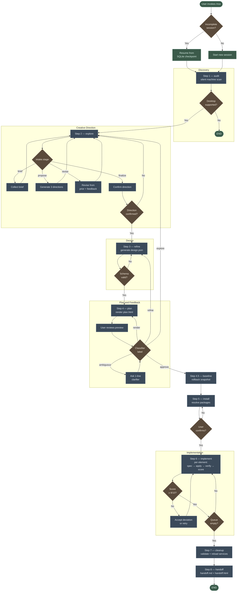

# hermes-theme-workshop

**AI-agent skills for safe, reversible Linux desktop personalization.**

Describe a feeling. The agent audits your machine, generates a design system, applies it across KDE Plasma / Hyprland / GTK / terminals / bars / wallpapers, and leaves you with a full rollback record.

Extracted from real-world usage on Arch Linux / KDE Plasma / Hyprland.


> *Chrysalis, Cortex, and Extraction — three themes generated live in a single Hyprland ricing session.*

---

## Two Systems, One Repo

This repo covers **both** Hermes output styling and desktop environment theming.
They are independent — pick one or both.

| System | What it changes | Skill |
|---|---|---|
| **CLI Skinning** | How Hermes *looks in the terminal* — colors, banners, prompt | `hermes-cli-skin` |
| **Desktop Ricing** | Your actual Linux desktop — KDE Plasma, Hyprland, GTK, wallpapers | `linux-ricing` (v3) ★ |

---

# Part 1 — CLI Skinning (Terminal Themes)

## Installation

```bash
git clone https://github.com/H-Ali13381/hermes-theme-workshop
SKILL_DST=~/.hermes/skills/creative/hermes-cli-skin

mkdir -p "$SKILL_DST"
rsync -a hermes-theme-workshop/skills/hermes-cli-skin/ "$SKILL_DST/"
```

Verify in a Hermes session: `/skills` — you should see `hermes-cli-skin` listed.

## Usage

Just tell Hermes what you want:

> *"Create a DragonFable-themed skin — dark background, gold and crimson accents. I have Nerd Fonts installed."*

> *"Generate a banner from this image and apply it as my skin."*

The agent handles art generation, YAML writing, and activation. See `examples/dragonfable.yaml` for a reference skin.

---

# Part 2 — Desktop Ricing (KDE, Hyprland, GTK)

> ★ **`linux-ricing` (v3)** is the main skill — a single AI-native desktop design system covering KDE Plasma, Hyprland, and shared layers (GTK, terminals, wallpaper, palette extraction).

## Installation

```bash
git clone https://github.com/H-Ali13381/hermes-theme-workshop
SKILL_DST=~/.hermes/skills/creative/linux-ricing

mkdir -p "$SKILL_DST"
rsync -a hermes-theme-workshop/ "$SKILL_DST/"

# Install dependencies and symlink ricer into ~/.local/bin
bash "$SKILL_DST/scripts/setup.sh"
```

## Usage

Just ask Hermes:

> *"Rice my desktop."*

The agent will audit your setup, propose a direction, and walk you through the rest interactively. You can be as vague or specific as you like — describe a mood, a color palette, a game, or just say "something dark and minimal."

## What Gets Themed

| Layer | Controls | Tool |
|---|---|---|
| **Colorscheme** | Qt window borders, titlebars, system menus | `plasma-apply-colorscheme` |
| **Kvantum** | Buttons, scrollbars, dropdowns, checkboxes | `kvantum.kvconfig` |
| **Plasma theme** | Panel background, tooltips, dialogs | `plasma-apply-desktoptheme` |
| **Cursor** | Mouse cursor theme | `plasma-apply-cursortheme` |
| **Konsole / Terminal** | Terminal colors and profiles | `.profile` + `.colorscheme` |
| **Wallpaper** | Per-monitor wallpaper and fill mode | `plasma-apply-wallpaperimage` |
| **Hyprland** | Borders, animations, hyprlock, waybar, rofi, dunst, fastfetch | templates under `Hyprland/` |
| **Cross-env** | GTK, polybar, picom, mako, swaync, wofi, shell prompt | templates under `shared/` |

## Built-in Presets

| Name | Description |
|------|-------------|
| `catppuccin-mocha` | Soothing pastel dark |
| `nord` | Arctic blue |
| `gruvbox-dark` | Retro groove warm |
| `dracula` | Vibrant neon purple |
| `tokyo-night` | Dark cyberpunk |
| `rose-pine` | Soft nature pastels |
| `solarized-dark` | Low-contrast warm |
| `doom-knight` | Gothic gold and crimson |
| `void-dragon` | Void sky, cyan blade, gold filigree |
| `shiva-temple` | Cosmic void, third-eye indigo, vermillion sindoor |

## How It Works

The workflow is a LangGraph pipeline with 8 checkpointed steps and tiered feedback loops at the visual-preview gate:



The 8 steps:

1. **Audit** — silent machine scan (WM, GPU, installed apps, config paths)
2. **Explore** — creative direction loop with the user
3. **Refine** — design JSON generation and approval
4. **Plan** — HTML mockup for visual review
5. **Baseline** — immutable rollback snapshot before any writes
6. **Install** — missing packages via pacman/yay
7. **Implement** — per-target materializers apply, verify, and score each element
8. **Handoff** — session doc written; undo manifest finalized

**Tiered feedback at Step 4.** When the user reviews the preview, an LLM classifier reads their response and routes the workflow to the right level: `approve` proceeds, `render` re-renders the same design, `refine` jumps back to Step 3 to revise `design.json`, and `explore` jumps back to Step 2's new revise stage to rework the creative direction itself. Ambiguous feedback triggers a one-line clarifying question instead of a guess.

Every change is protected by three backup layers: pre-flight timestamped config copies, immutable baselines, and the scripts themselves tracked in git. Interrupted sessions resume from the exact step where they stopped — nothing already applied gets re-run.

## Example Prompts

> *"Load linux-ricing and run a dry-run of the void-dragon preset. Show me what would change."*

> *"Capture my current KDE desktop state, then apply the doom-knight preset with a custom wallpaper."*

> *"Use linux-ricing to generate three Marathon-style themes from these reference images and wire up animated wallpapers."*

---

## Contributing

PRs welcome:
- Add skin YAMLs to `examples/`
- Add presets to `scripts/presets.py`
- Add Jinja2 config templates to `templates/`
- Note new pitfalls in the relevant `SKILL.md`
- Add CC0 images to `assets/`

---

## Troubleshooting

Session pitfalls and hard-won debugging notes are collected in `shared/troubleshooting.md` — organized by component (KDE, Hyprland, GTK, waybar, terminals, wallpaper, rollback, screenshots).

---

## Sources

- `linux-ricing` (v3): consolidated from real-world KDE/Hyprland/GNOME ricing sessions
- `hermes-cli-skin`: terminal/CLI skinning skill
- Hermes core: [NousResearch/hermes-agent](https://github.com/NousResearch/hermes-agent)
- Braille Unicode reference: [Braille Patterns (Wikipedia)](https://en.wikipedia.org/wiki/Braille_Patterns)
- ASCII art ramps: [Paul Bourke](http://paulbourke.net/dataformats/asciiart/)
