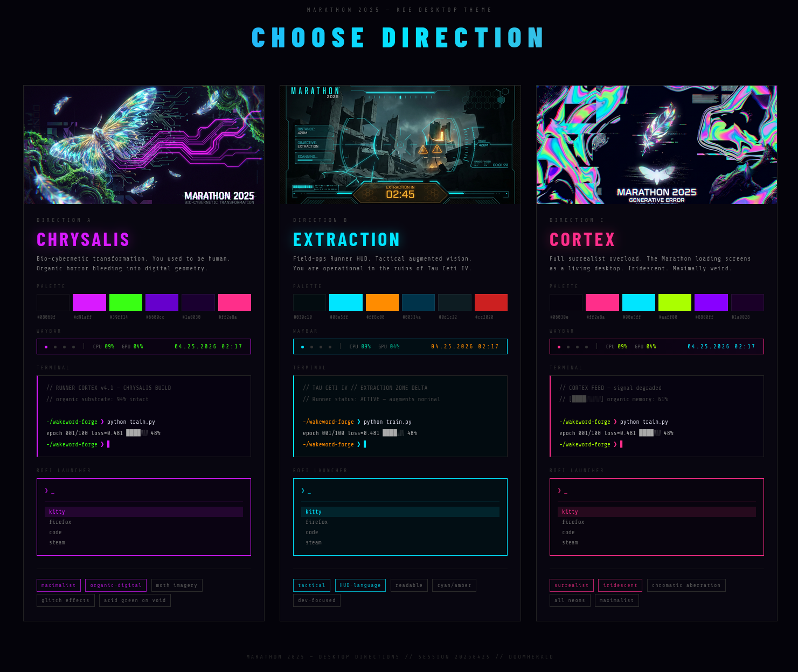

# hermes-theme-workshop

**Hermes agent skills for desktop personalization** — terminal skins, full DE theming
engines, and everything in between. Extracted from iterative real-world usage on
Arch Linux / KDE Plasma / Hyprland.



> *Three themes (Chrysalis, Cortex, Extraction) generated live in a single Hyprland
> ricing session — see [Part 2](#part-2--desktop-ricing-kde-hyprland-gtk).*

---

## What's Here

```
linux-ricing/                                   ★ AI-native desktop design system (v3)
├── SKILL.md                                    ← entry point, 8-step workflow, full index
├── QUICKSTART.md                               ← zero-to-themed-desktop in 5 minutes
├── README.md                                   ← this file
├── manifest.json                               ← skill manifest
│
├── workflow/                                   ← LangGraph workflow engine
│   ├── graph.py                                ← pipeline: all 8 steps, sequence, routing
│   ├── run.py                                  ← CLI entry (start / --resume / --list)
│   ├── state.py                                ← RiceSessionState TypedDict
│   ├── routing.py                              ← conditional edge functions
│   ├── validators.py                           ← gate conditions for each phase
│   ├── session.py                              ← session log writer
│   ├── config.py                               ← recipe schemas (KDE / GNOME / Hyprland)
│   ├── utils.py                                ← CSS brace balancing, JSONC comment stripping
│   └── nodes/
│       ├── audit/       ← Step 1: silent machine scan, WM/GPU/app detection
│       ├── explore.py   ← Step 2: creative direction loop
│       ├── refine.py    ← Step 3: design JSON refinement loop
│       ├── plan.py      ← Step 4: HTML mockup loop
│       ├── baseline.py  ← Step 4.5: immutable rollback snapshot
│       ├── install/     ← Step 5: package installation (pacman + yay)
│       ├── implement/   ← Step 6: per-element apply → verify → score → gate
│       ├── cleanup/     ← Step 7: validate configs, reload daemons
│       └── handoff.py   ← Step 8: write session documentation
│
├── scripts/
│   ├── ricer.py                                ← materializer CLI (23 app targets)
│   ├── ricer_undo.py                           ← rollback engine
│   ├── presets.py                              ← built-in design presets (11 themes)
│   ├── palette_extractor.py                    ← image → 10-slot semantic palette
│   ├── desktop_state_audit.py                  ← full desktop state snapshot
│   ├── desktop_utils.py                        ← shared WM/DE detection
│   ├── session_manager.py                      ← session state CLI
│   ├── session_helpers.py                      ← session phases 0–3
│   ├── session_phases.py                       ← session phases 4–6
│   ├── deterministic_ricing_session.py         ← scripted apply protocol
│   ├── icon_theme_gen.py                       ← icon theme recoloring / generation
│   ├── capture_theme_references.py / capture_apply.py / capture_constants.py / capture_helpers.py
│   ├── reference_capture_window.py / generate_panel_svg.py
│   ├── setup.sh / requirements.txt
│   ├── core/                                   ← shared utilities
│   │   ├── colors.py                           ← hex↔RGB, hue rotation, lightness, YIQ (single source of truth)
│   │   ├── palette_primitives.py               ← re-exports from colors.py under private names
│   │   ├── palette_engine.py                   ← image quantisation, swatch classification, slot assignment
│   │   ├── process.py                          ← subprocess helpers, cmd_exists, _kread
│   │   ├── backup.py                           ← file backup and injection removal
│   │   ├── discovery.py                        ← app detection (KDE, GNOME, Hyprland, terminals, bars…)
│   │   ├── snapshots.py                        ← pre-flight KDE/Konsole state capture
│   │   ├── templates.py                        ← Jinja2 / simple {{key}} renderer
│   │   ├── constants.py                        ← paths, palette schema
│   │   ├── config_parsers.py                   ← INI/appletsrc/hyprland config parsing
│   │   ├── session_io.py / session_md_utils.py ← session markdown I/O
│   │   ├── state_capture.py / audit_utils.py   ← desktop audit helpers
│   │   ├── icon_scoring.py                     ← SVG colour sampling and Breeze recoloring
│   │   └── undo_describe.py                    ← human-readable undo preview
│   └── materializers/                          ← per-app theme writers
│       ├── kde.py / kde_extras.py              ← colorscheme, kvantum, plasma theme, cursor, icons, lockscreen
│       ├── terminals.py / terminal_colors.py   ← kitty, alacritty, konsole
│       ├── bars.py                             ← waybar, polybar
│       ├── launchers.py                        ← rofi, wofi
│       ├── notifications.py                    ← dunst, mako, swaync
│       ├── hyprland.py                         ← borders, hyprlock
│       ├── gnome.py                            ← gnome-shell theme, lock screen
│       ├── system.py                           ← gtk, picom, fastfetch, starship
│       └── wallpaper.py                        ← multi-backend wallpaper setter
│
├── shared/                                     ← cross-env docs
├── KDE/                                        ← KDE Plasma specific docs
├── Hyprland/                                   ← Hyprland specific docs
├── templates/                                  ← Jinja2 config templates (13 apps)
├── assets/                                     ← catalog, palettes, previews, wallpapers
├── dev/                                        ← design philosophy, handoff notes, research
├── references/                                 ← color-extractor architecture, ecosystem research
├── examples/                                   ← example skin YAML (dragonfable)
│
├── tests/
│   ├── test_kde_materializers.py               ← KDE colorscheme, kvantum, cursor, plasma, konsole, icon, snapshot
│   ├── test_kde_lockscreen_materializer.py     ← lock screen LnF selection, kreadconfig fallback, routing
│   ├── test_kde_undo.py                        ← rollback correctness
│   ├── test_starship_materializer.py           ← starship prompt theming
│   ├── test_palette_extractor.py               ← palette extraction pipeline
│   ├── test_bug_reproducers.py                 ← live KDE integration tests (P0–P3)
│   ├── test_capture_theme_references.py
│   ├── test_cleanup_reloader.py                ← daemon reload error propagation
│   ├── test_desktop_recipes.py                 ← recipe detection and per-recipe validation
│   ├── test_implement_spec.py                  ← ElementSpec structured output
│   ├── test_install_resolver.py                ← pacman/yay timeout and fallback
│   ├── test_ricer_cli_routing.py               ← CLI fail-closed routing
│   └── test_workflow_audit.py                  ← audit state, recipe classification
│
└── skills/                                     ← sub-skills (legacy, kept for reference)
    ├── hermes-cli-skin/    ← terminal/CLI skinning (colors, banner art)
    ├── hermes-ricer/       ← legacy: deterministic KDE theming engine
    ├── hyprland-rice-from-scratch/
    ├── ricer-apps/ / ricer-catalog-capture/ / ricer-gtk/
    ├── ricer-kde/ / ricer-rollback/ / ricer-wallpaper/
```

> **`linux-ricing` (v3) is the current consolidated skill** and the recommended
> entry point for desktop ricing. The `hermes-ricer` split-skill suite is kept
> for reference but is no longer actively maintained.

---

## Two Systems, One Repo

This repo covers **both** Hermes output styling and desktop environment theming.
They are independent — pick one or both.

| System | What it changes | Skill |
|---|---|---|
| **CLI Skinning** | How Hermes *looks in the terminal* — colors, banners, prompt | `hermes-cli-skin` |
| **Desktop Ricing** | Your actual Linux desktop — KDE Plasma, Hyprland, GTK, wallpapers | `linux-ricing` (v3) ★ |

If you only want a cool terminal banner, read **Part 1**.
If you want to transform your entire desktop, read **Part 2**.

---

# Part 1 — CLI Skinning (Terminal Themes)

### Phase 1 — Install the Skill

```bash
# Clone this repo first
git clone https://github.com/H-Ali13381/hermes-theme-workshop
cd hermes-theme-workshop

mkdir -p ~/.hermes/skills/autonomous-ai-agents/hermes-cli-skin/scripts

# Copy the skill definition and scripts
cp skills/hermes-cli-skin/SKILL.md ~/.hermes/skills/autonomous-ai-agents/hermes-cli-skin/
cp skills/hermes-cli-skin/scripts/img_to_braille.py \
   skills/hermes-cli-skin/scripts/image_to_hero.py \
   ~/.hermes/skills/autonomous-ai-agents/hermes-cli-skin/scripts/
```

Verify Hermes sees it — in a Hermes session:
```
/skills
```
You should see `hermes-cli-skin` listed.

### Phase 2 — Understand Your Environment

Before generating art, tell your Hermes agent:

> *"Update the hermes-cli-skin skill to reflect my environment:*
> - *Hermes skins go in `~/.hermes/skins/`*
> - *Config is at `~/.hermes/config.yaml`*
> - *Python with Pillow+numpy is available at `/usr/bin/python3`*
> - *Skills are in `~/.hermes/skills/`"*

### Phase 3 — Choose a Theme Direction

Tell your agent what look you want. Be specific:
- **Color palette** — dark/moody, bright/neon, gold/fantasy, tech-blue, etc.
- **Tone** — playful, serious, dramatic, minimal
- **Reference** — a game, a character, a logo, a color hex code
- **Terminal font** — if you have Nerd Fonts installed, say so (unlocks braille safely)

Example prompt:
> *"Create a DragonFable-themed skin — dark background, gold and crimson accents,
> fantasy/RPG tone. I have Nerd Fonts installed."*

### Phase 4 — Generate Banner Art

**Why Braille Unicode is the baseline recommendation:**

The Braille Unicode block (U+2800–U+28FF) gives **2×4 sub-pixel resolution per character cell**
(8 individually addressable dots). At the same character count, it preserves 4× more detail
than standard ASCII ramps. Critically, Braille characters are **always 1 column wide**
(unlike `░▒▓█` block chars which render double-width on many terminals).

**Hard dimension limits** from `banner.ts`:

| Field | Width | Height | Notes |
|---|---|---|---|
| `banner_hero` | **30 cols** | **15 rows** | Left column beside tool list |
| `banner_logo` | **≤100 cols** | ≤12 rows | Above everything, terminal ≥95 cols only |

**4a. Get a source image**

```bash
mkdir -p ~/.hermes/assets/theme
wget -O ~/.hermes/assets/theme/mylogo.png "https://example.com/logo.png"
```

Good sources:
- Your project/game logo on a transparent background (PNG preferred)
- High-contrast portraits or mascots
- CC0 images from Unsplash, OpenGameArt, Pixabay

**4b. Generate Braille art (recommended)**

```bash
# banner_hero (30×15) — the small hero beside the tools list
python3 ~/.hermes/skills/autonomous-ai-agents/hermes-cli-skin/scripts/img_to_braille.py \
  --input ~/.hermes/assets/theme/mylogo.png \
  --width 30 --height 15 \
  --palette gold \
  --out-preview

# Once happy with shape, generate YAML value:
python3 ~/.hermes/skills/autonomous-ai-agents/hermes-cli-skin/scripts/img_to_braille.py \
  --input ~/.hermes/assets/theme/mylogo.png \
  --width 30 --height 15 \
  --palette gold \
  --out-yaml
```

**4c. Or generate ASCII ramp art (classic/retro style)**

```bash
python3 ~/.hermes/skills/autonomous-ai-agents/hermes-cli-skin/scripts/image_to_hero.py \
  ~/.hermes/assets/theme/mylogo.png \
  --ramp classic \
  --palette gold \
  --plain
```

### Phase 5 — Write the Skin YAML

```bash
mkdir -p ~/.hermes/skins
```

Create `~/.hermes/skins/myskin.yaml`. Minimal example:

```yaml
name: myskin
description: "My custom theme"

colors:
  banner_border:   "#8c1a2e"
  banner_title:    "#c9a227"
  banner_accent:   "#c9a227"
  banner_dim:      "#5a3a0a"
  banner_text:     "#e8dcc8"
  ui_accent:       "#c9a227"
  response_border: "#c9a227"
  input_rule:      "#8c1a2e"
  prompt:          "#e8dcc8"

branding:
  agent_name:     "YourName"
  welcome:        "Your welcome message"
  goodbye:        "Your goodbye message"
  prompt_symbol:  "> "

banner_hero: "paste output from img_to_braille.py here"
```

See `examples/dragonfable.yaml` for a fully worked example.

**⚠️ Critical — don't use regex to update banner fields.** These fields are single-line
YAML scalars with embedded `\n` escapes and Rich markup. `re.sub` corrupts them.
Always rebuild the full YAML from a template string and overwrite the file.

### Phase 6 — Activate and Iterate

```bash
# Activate in current Hermes session (no restart needed)
/skin myskin

# Make permanent — edit ~/.hermes/config.yaml and add:
#   display:
#     skin: myskin
# Don't use >> append — running it twice creates duplicate keys.
```

**Common issues:**

| Symptom | Cause | Fix |
|---|---|---|
| Banner drifts / jagged lines | Spaces trimmed by `trimEnd()` | Ensure scripts use `⠀` (U+2800) not ASCII spaces |
| Colored feature invisible (e.g. red gem) | Grayscale-only mask silently drops saturated dark colors | Use `--lum-threshold 90 --red-ratio-g 1.2` |
| Block chars look double-wide | `░▒▓█` ambiguous-width on your terminal | Switch to `--ramp classic` or use Braille |
| Logo not centered | `banner_logo` is not auto-centered by renderer | Strip leading gutter or pad symmetrically |
| YAML parse error | Regex-patched a banner field | Rebuild entire YAML from template string |

---

# Part 2 — Desktop Ricing (KDE, Hyprland, GTK)

> ★ The featured skill in this repo is **`linux-ricing` (v3)** — a single
> consolidated AI-native desktop design system covering KDE Plasma, Hyprland,
> and shared layers (GTK, terminals, wallpaper, palette extraction).

### Quick Start (`linux-ricing` v3)

```bash
# 1. Clone this repo
git clone https://github.com/H-Ali13381/hermes-theme-workshop
SKILL_DST=~/.hermes/skills/creative/linux-ricing

mkdir -p "$SKILL_DST"
rsync -a hermes-theme-workshop/ "$SKILL_DST/"

# 2. Run setup (installs jinja2, pillow, symlinks ricer into ~/.local/bin)
bash "$SKILL_DST/scripts/setup.sh"

# 3. Dry-run a preset
ricer preset void-dragon --dry-run

# 4. Apply
ricer preset void-dragon

# 5. Undo if needed
ricer undo

# 6. Or run the full AI workflow
python3 "$SKILL_DST/workflow/run.py"
# Resume a paused session:
python3 "$SKILL_DST/workflow/run.py" --resume <thread-id>
```

Then trigger the skill from a Hermes session:
> *"Load the linux-ricing skill and rice my desktop."*

For the fast path, see `QUICKSTART.md`.

### What Gets Themed

| Layer | Controls | Tool |
|---|---|---|
| **Colorscheme** | Qt window borders, titlebars, system menus | `plasma-apply-colorscheme` |
| **Kvantum** | Buttons, scrollbars, dropdowns, checkboxes | `kvantum.kvconfig` |
| **Plasma theme** | Panel background, tooltips, dialogs | `plasma-apply-desktoptheme` |
| **Cursor** | Mouse cursor theme | `plasma-apply-cursortheme` |
| **Konsole / Terminal** | Terminal colors and profiles | `.profile` + `.colorscheme` |
| **Wallpaper** | Per-monitor wallpaper and fill mode | `plasma-apply-wallpaperimage` |
| **Hyprland** | Borders, animations, hyprlock, waybar, rofi, dunst, fastfetch | templates under `Hyprland/` |
| **Cross-env** | GTK, polybar, picom, mako, swaync, wofi, shell prompt | templates under `shared/` |

### Built-in Presets

| Name | Description |
|------|-------------|
| `catppuccin-mocha` | Soothing pastel dark |
| `nord` | Arctic blue |
| `gruvbox-dark` | Retro groove warm |
| `dracula` | Vibrant neon purple |
| `tokyo-night` | Dark cyberpunk |
| `rose-pine` | Soft nature pastels |
| `solarized-dark` | Low-contrast warm |
| `doom-knight` | Gothic gold and crimson (DragonFable) |
| `void-dragon` | Void sky, cyan blade, gold filigree |
| `shiva-temple` | Cosmic void, third-eye indigo, vermillion sindoor |
| `bareblood` | Gothic maximalist — blood reds, wine blacks, amber accents |

### Example — Marathon 2025 Themes

Three themes generated live during a full desktop ricing session (Hyprland, April 2026).
Each has a matching animated wallpaper at
`assets/wallpapers/marathon/seedance2/`.


| Theme | Palette character | Wallpaper |
|-------|-------------------|-----------|
| **Chrysalis** | Deep purple, violet haze, cosmic transformation | `chrysalis.mp4` |
| **Cortex** | Dark teal, blue-green neural tones, dark steel | `cortex.mp4` |
| **Extraction** | Steel blue, slate grey, cold white highlights | `extraction.mp4` |

### Inside `linux-ricing` (deep reference)

Everything is in one skill — load `SKILL.md` and pull in the file you need:

**Workflow engine** (`workflow/`)
- `graph.py` — the full pipeline: all 8 steps, their order, and every routing condition
- `run.py` — CLI entry: `python3 workflow/run.py` to start, `--resume <id>` to continue, `--list` to show sessions
- `state.py` — `RiceSessionState` TypedDict; append-only keys (`impl_log`, `errors`, `messages`) use LangGraph reducers
- `routing.py` — conditional edge functions with loop-limit safety guards
- `validators.py` — gate functions: `direction_confirmed`, `design_complete`, `plan_ready`, `implement_done`
- `config.py` — recipe schemas; KDE requires `kvantum_theme` + `plasma_theme`, GNOME/Hyprland require only GTK + cursor + icon
- `utils.py` — CSS brace balancing, JSONC comment stripping
- `nodes/` — one module per step: `audit/`, `explore`, `refine`, `plan`, `baseline`, `install/`, `implement/`, `cleanup/`, `handoff`

**Materializer CLI** (`scripts/`)
- `ricer.py` — 23 app materializers; use `--only=<target>` or `--app=<target>` for single-target apply
- `presets.py` — 11 built-in design presets (catppuccin-mocha through bareblood)
- `ricer_undo.py` — full rollback engine with per-app undo handlers
- `palette_extractor.py` — image → 10-slot semantic palette with mood tags and theme-name defaults
- `desktop_state_audit.py` — full desktop state snapshot for immutable baselines
- `desktop_utils.py` — shared WM/DE detection (single source of truth for scripts + workflow)
- `core/` — shared utilities: color math, subprocess helpers, backup, discovery, templates, session I/O
- `materializers/` — per-app theme writers: KDE (6 sub-targets), terminals (3), bars (2), launchers (2), notifications (3), GNOME (2), Hyprland (2), system (4), wallpaper (5 backends)

**Reference docs**
- `SKILL.md` — entry point, 8-step workflow, master index
- `QUICKSTART.md` — zero-to-themed-desktop in 5 minutes
- `KDE/` — colorscheme, kvantum, plasma-panel, cursor, konsole, splash screen, wallpaper, widgets, setup
- `Hyprland/` — borders/animations, hyprlock, waybar, rofi, dunst, fastfetch, wallpaper, widgets, setup
- `shared/` — design system, palette extraction, wallpaper generation, GTK, terminal, shell prompt, polybar, picom, mako, swaync, wofi, rollback, catalog capture, braille art, templates
- `templates/` — Jinja2 config templates for 13 apps
- `assets/catalog/` — curated bars, cursors, kvantum themes, launchers, notifications, palettes, terminals, themes
- `references/` — color-extractor architecture, ricing ecosystem research
- `dev/` — design philosophy, handoff notes, research (corporate design, counterculture, game UI, usability)

### Legacy Skills (kept for reference)

These predate `linux-ricing` and are not actively maintained. Use only if you
need the older split-skill flow:

- `hermes-ricer` — legacy deterministic KDE theming engine
- `hyprland-rice-from-scratch` — legacy full Hyprland tiling WM setup
- `ricer-kde` — legacy KDE Plasma deep-dive
- `ricer-gtk` — legacy GTK theming layer
- `ricer-apps` — legacy app-level materializers (Kitty, Rofi, Waybar)
- `ricer-wallpaper` — legacy wallpaper generation
- `ricer-rollback` — legacy rollback architecture and 3-layer backup system
- `ricer-catalog-capture` — legacy screenshot catalog workflow

### Safety Model

The ricer engine is built on one rule: **every change must be reversible,
audited, and reproducible.**

```
Capture baseline → Dry-run → Review diff → Apply → Verify → Rollback if needed
```

Three backup layers protect you:
1. **Git** — tracks the scripts themselves (`~/.hermes/skills/creative/linux-ricing/`)
2. **Pre-flight backups** — timestamped copies of all affected configs before every apply
3. **Immutable baselines** — complete desktop state snapshots from `desktop_state_audit.py`

**Resume safety** — Each workflow step is its own LangGraph node with a real
checkpoint boundary. If a session is interrupted (Ctrl+C, crash, reboot), resuming
with `python3 workflow/run.py --resume <thread-id>` re-enters at the exact step
where it stopped — not the beginning. Already-applied elements are never re-processed.

---

## Prompt Chains

### CLI Skinning

> *"Install the hermes-cli-skin skill and create a [description] skin called 'mytheme'. I have Nerd Fonts."*

> *"Generate a 30×15 Braille banner_hero from this image, preview first, then write the full skin YAML."*

### Desktop Ricing

> *"Load linux-ricing and run a dry-run of the void-dragon preset. Show me what would change."*

> *"Capture my current KDE desktop state, then apply the doom-knight preset with a custom wallpaper."*

> *"Use linux-ricing to generate three Marathon-style themes from these reference images and wire up animated wallpapers."*

---

## Contributing

PRs welcome:
- Add your skin YAML to `examples/`
- Add new presets to `scripts/presets.py` (and update the preset table above)
- Add Jinja2 config templates to `templates/`
- Update any `SKILL.md` with new pitfalls you discover
- Add sample images to `assets/` (CC0 only)

---

## Sources

- `linux-ricing` (v3): consolidated from real-world KDE/Hyprland/GNOME ricing sessions
- `hermes-cli-skin`: terminal/CLI skinning skill
- Hermes core + built-in skins: [NousResearch/hermes-agent](https://github.com/NousResearch/hermes-agent)
- Braille Unicode encoding reference: [Braille Patterns (Wikipedia)](https://en.wikipedia.org/wiki/Braille_Patterns)
- ASCII art ramps: [Paul Bourke's character ramp](http://paulbourke.net/dataformats/asciiart/)
